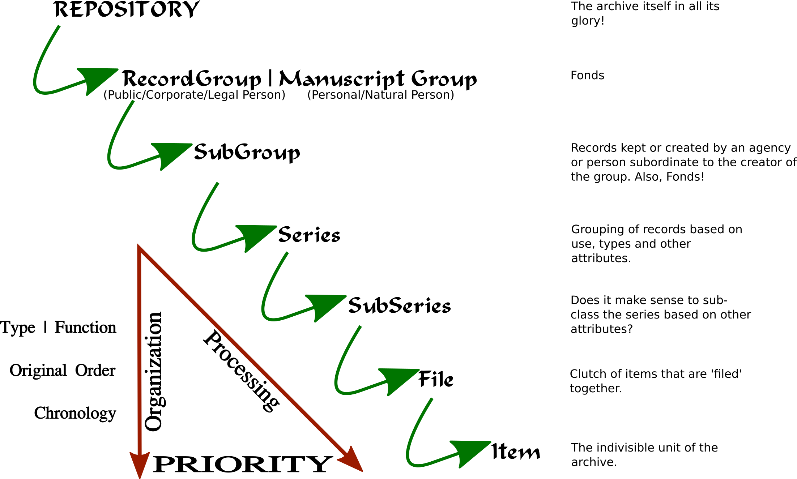

# Processing The Material

## Introduction

Processing archival material that manages to flow through the policy into the archive's holdings has just begun its archival journey. The key milestones for every acquired material are outlined in this segment of the guide. Each milestone in this processing workflow carries its own _definition of done_ and different materials could be in different stages and yet still be an integral part of the archive.

At each stage of processing the material, the resources at hand must be mapped to the quanta of work that needs to be done and if there are enough resources to satisfactorily move the material to the next stage only then should the task be taken up. 

> Patience is an indication of the intent to do things well!

Understanding the organization of the material is a good way to understand the processing workflow. 

## Information Structure

### Repository

### Record Group OR Manuscript Group

### Subgroup

### Series

### Sub series

### File

### Item

